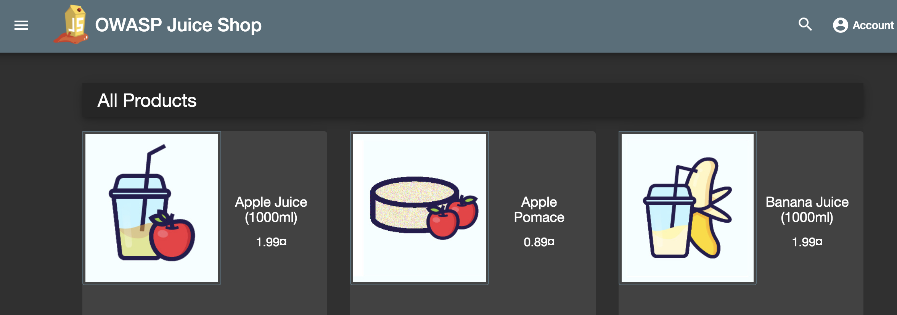

# aws-juiceshop-app-tf

This repo contain terraform and ansible code to provision a environment with below components in AWS.
- VPC
- Security Group
- Nginx
- Application (juiceshop app)
- ELB

## Requirements 
- ansible >= 2.8.5 should be installed.
- terraform >= 0.13.0 should be installed.
- aws account

## Steps to provition application 

### 1. Generate ssh key using below command.

```
ssh-keygen
Generating public/private rsa key pair.
Enter file in which to save the key (~/.ssh/id_rsa):
Created directory '~/.ssh'.
Enter passphrase (empty for no passphrase):
Enter same passphrase again:
Your identification has been saved in ~/.ssh/id_rsa.
Your public key has been saved in ~/.ssh/id_rsa.pub.
The key fingerprint is:
The key's randomart image is:
+---[RSA 2048]----+
....
+----[SHA256]-----+
```

### 2. Run terraform script 

```
terraform  init
terraform  plan 
terraform apply -auto-approve

var.app_instance_count
  Enter a value: 2

var.project_name
  Enter a value: smart-pension-proj

var.web_instance_count
  Enter a value: 2

aws_key_pair.sshkey: Refreshing state... [id=sshkey]
aws_vpc.main: Refreshing state... [id=XXXXXXXXXXX]
aws_subnet.main-private-1: Refreshing state... [id=XXXXXXXXXXXX]
....
Outputs:

ELB = sptest-elb-XXXXXXXXXX.us-east-1.elb.amazonaws.com
......
```

### 3. Now appliication should be accessible from ELB URL



## Terraform Variables

| Variable | Description | Default |
| :---: | :---: | :---: |
| AWS_ACCESS_KEY | Login to AWS account | NA |
| AWS_SECRET_KEY | Login to AWS account | NA |
| AWS_REGION | aws region | us-east-1 |
| PATH_PRIVATEKEY | private key which will be used during ansible execution | ~/.ssh/id_rsa |
| PATH_PUBLICKEY | public key which will be used during ansible execution  | ~/.ssh/id_rsa.pub |
| app_instance_count | number of app instance | 2 |
| web_instance_count | number of web instance | 2 |
| project_name | project name | sptest |
